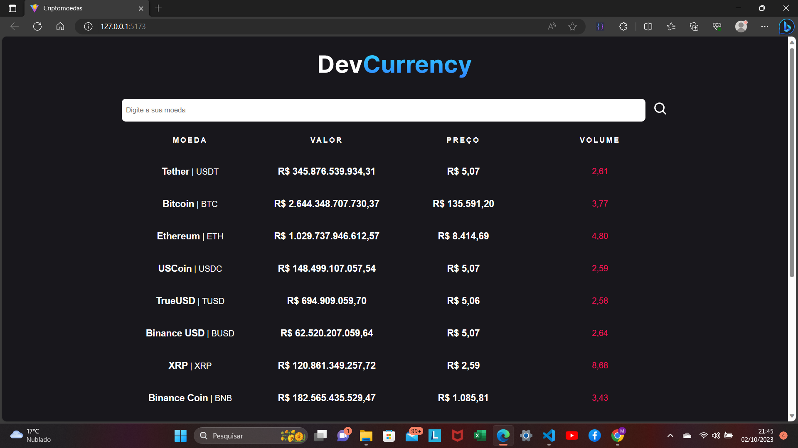
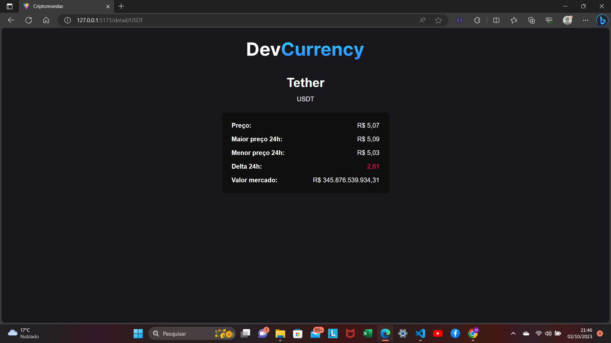
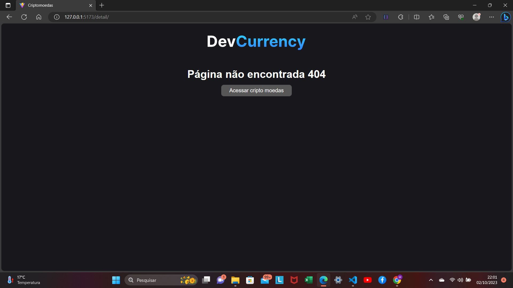

# WebSite Criptomoedas

| :placard: Vitrine.Dev | Matheus da Trindade Lima                                                                  |
| --------------------- | ----------------------------------------------------------------------------------------- |
| :sparkles: Name       | **WebSite de Criptomoedas**                                                    |
| :label: Technologies  | React, TypeScript                                          |
| :bulb: Skills         | Desenvolvendo um site que faz requisições para uma API externa e renderiza na tela do usuário com os dados fornecidos. |

# WebSite 

<p>
    **Projeto Desenvolvido: Site de Criptomoedas com Requisições API e Tipo Seguro**

Neste projeto web, criei um site com o objetivo de efetuar requisições a uma API externa e manipular seus dados. O projeto consiste em três páginas principais:

1. **Página Inicial (Home):** Esta página exibe informações sobre diversas criptomoedas, permitindo aos usuários explorar as opções disponíveis.

2. **Página de Detalhes:** Quando o usuário seleciona uma moeda específica, ele é redirecionado para uma página que apresenta informações detalhadas sobre a criptomoeda escolhida.

3. **Página 404 (Não Encontrada):** Em caso de acesso a uma URL inválida ou a uma criptomoeda inexistente, uma página de erro 404 é exibida.

Para aprimorar a complexidade do projeto, adotei as seguintes tecnologias e práticas:

- **TypeScript:** Utilizei o TypeScript para adicionar tipos aos dados, tornando a aplicação mais segura e menos suscetível a erros.

- **Vite:** Iniciei o projeto com o Vite, uma ferramenta de desenvolvimento rápido, para acelerar a criação do aplicativo.

- **React:** Utilizei uma versão atualizada do React, garantindo que o projeto estivesse alinhado com as melhores práticas e recursos mais recentes.

- **React Router DOM:** Para a navegação entre páginas, adotei a biblioteca React Router DOM, que facilita o roteamento na aplicação web.

Este projeto permite aos usuários explorar informações sobre criptomoedas de maneira intuitiva e segura, graças à combinação de tecnologias modernas e boas práticas de desenvolvimento.
</p>

## Layout web

### Imagens do site

### Página inicial


### Página de detalhes


### Página de not found 404


Clonar repositório

```bash
  https://github.com/Limatrindade/web-app-criptomoedas
```

## Front-end

Pré-requisitos: Navegador

Editar com IDE ou Editor de preferência.

Acessar utilizando navegador de preferência.

## Autor

Matheus da Trindade Lima

<a href="https://www.linkedin.com/in/matheus-lima-809407191/" target="_blank">
    
</a>